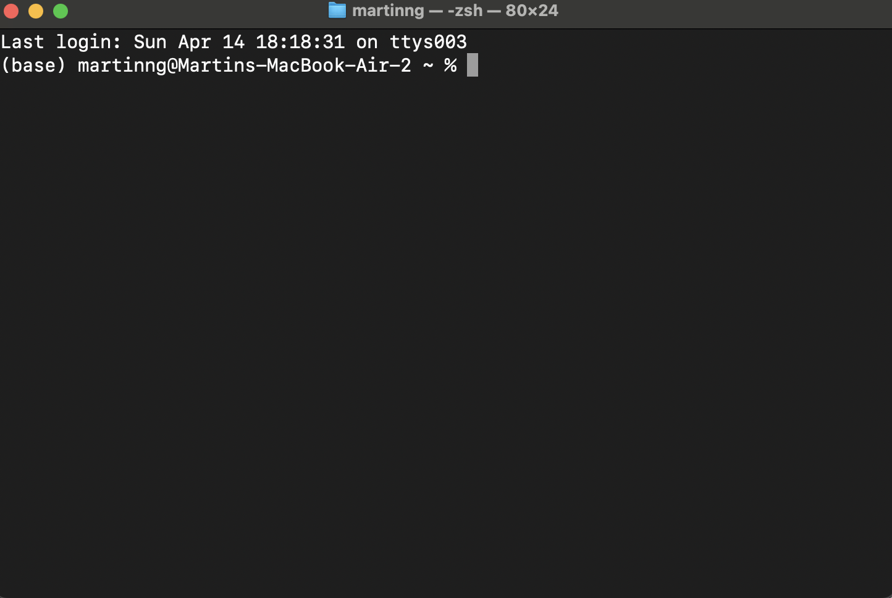
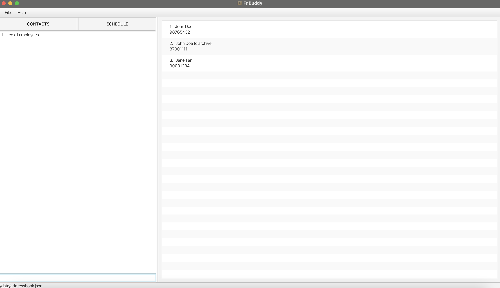
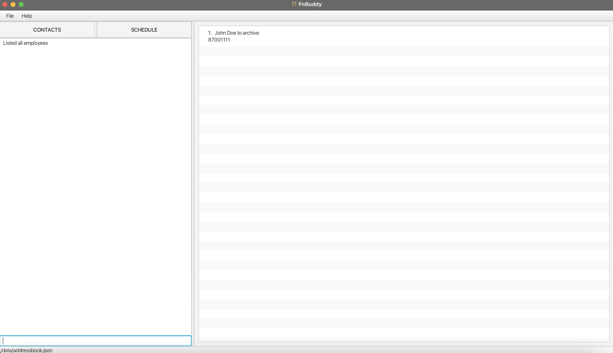
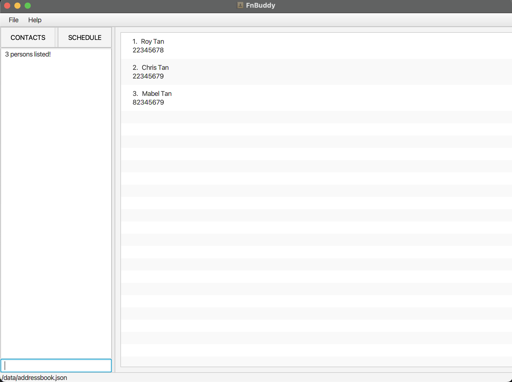
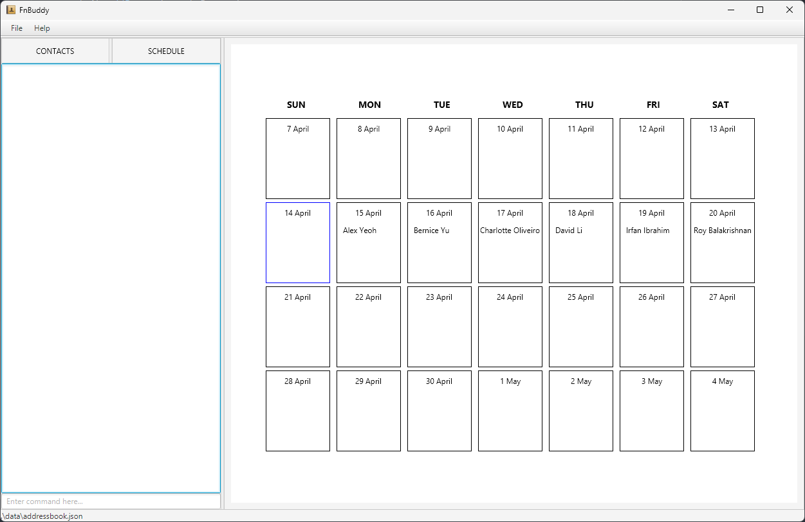
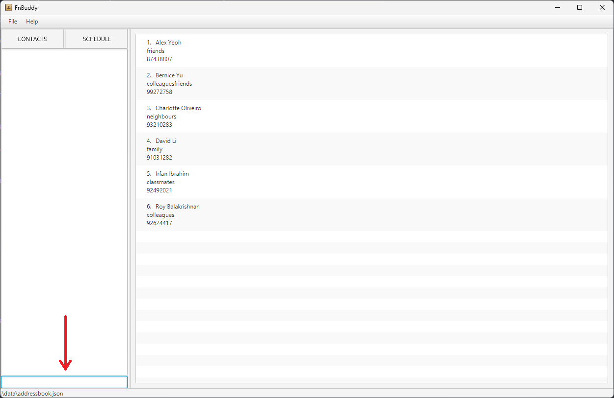

# FnBuddy User Guide

Welcome to the FnBuddy User Guide! This comprehensive guide is designed to help you navigate and utilise the FnBuddy part-time employee contact management application with ease.
Whether you need to create, update, schedule or retrieve the payroll of your employees, or simply wish to navigate the application seamlessly, this guide will equip you with the knowledge to do so effectively.

Our guide assumes that you are a restaurant manager with a basic understanding of using software applications, and are familiar with common restaurant operations and terminology.

## Table of Contents

- [FnBuddy User Guide](#fnbuddy-user-guide)
  - [Table of Contents](#table-of-contents)
  - [Introduction to FnBuddy](#introduction-to-fnbuddy)
  - [Quick start](#quick-start)
  - [Features](#features)
    - [Notes about the command format](#notes-about-the-command-format)
    - [Adding a person `add`](#adding-a-person-add)
    - [Listing contacts `list`](#listing-contacts-list)
    - [Deleting a person `delete`](#deleting-a-person-delete)
    - [Editing a person `edit`](#editing-a-person-edit)
    - [Locating a person by name `find`](#locating-a-person-by-name-find)
    - [Clear all contacts `clear`](#clear-all-contacts-clear)
    - [Exiting the program `exit`](#exiting-the-program-exit)
    - [Archiving the person `archive`](#archiving-the-person-archive)
    - [Unarchive the person `unarchive`](#unarchive-the-person-unarchive)
    - [Retrieving payroll `payroll`](#retrieving-payroll-payroll)
    - [Schedule employees `schedule`](#schedule-employees-schedule)
    - [Unschedule employees `unschedule`](#unschedule-employees-unschedule)
    - [Saving the data](#saving-the-data)
      - [Modifying saved data](#modifying-saved-data)
  - [GUI Components](#gui-components)
  - [Pages](#pages)
    - [Command Type](#command-type)
  - [Known issues](#known-issues)
  - [Planned Enhancements](#planned-enhancements)
    - [Adding a `view` feature](#adding-a-view-feature)
    - [Enhancements to Archive Feature](#enhancements-to-archive-feature)
    - [More Informative List Command Feedback](#more-informative-list-command-feedback)
  - [Glossary](#glossary)
  - [FAQ](#faq)
  - [Command summary](#command-summary)

## Introduction to FnBuddy

Whether you're a seasoned restaurant manager or new to the role, FnBuddy will serve as your trusted companion, empowering you to streamline your operations and enhance your team management capabilities. FnBuddy  manage contacts optimised for use via a Command Line Interface (CLI) while still having the benefits of a Graphical User Interface (GUI). So if you're a fast typer, FnBuddy is just the application for you!

Features that FnBuddy offers with your needs in mind include: 
- **contact creation and management** such as editing and archiving
- **scheduling** of part-time employee contacts on specified dates
- **payroll retrieval** that calculates the total payroll for all employees who worked within a specified date range (currently dependent on their scheduled hours).

## Quick start

1. Ensure you have Java 11 or above installed on your Computer.
2. Download the latest fnbuddy.jar from [here](https://github.com/AY2324S2-CS2103T-T17-4/tp/releases/latest/).
3. Move the fnbuddy.jar file to the directory you intend to designate as the home folder for your FnBuddy.
4. Open the terminal on your Operating System.
   - For Windows, press `Win + R`, type `cmd`, and press Enter.
   - For MacOS, press `Cmd + Space`, type `Terminal`, and press Enter.
   - For Linux, press `Ctrl + Alt + T`.
5. You should see a terminal window similar to the one below open. (The terminal window will look different depending on your Operating System.)
    
    |                |
    |--------------------------------------------------|
    | *Example of a terminal window on a MacOS system* |

6. Type `cd` followed by the path to the folder you copied the fnbuddy.jar file to.
   - Windows Example: `cd C:\Users\JohnDoe\Desktop\FnBuddy`.
   - MacOS Example: `cd /Users/JohnDoe/Desktop/FnBuddy`.
   - Linux Example: `cd /home/JohnDoe/Desktop/FnBuddy`.
7. Type `java -jar fnbuddy.jar` to run the application.
8. An application similar to the one below should appear in a few seconds. For a more detailed explanation of the Graphical User Interface (GUI) and 
   its components, refer to the [GUI Components](#gui-components). Note how the app contains some sample data. The list of contacts displayed at startup is the main list of unarchived contacts. More details in the [Features](#features) section below.

    |  |
    |------------------------|
    | *FnBuddy GUI*          |

9. Type the command in the command box and press Enter to execute it. e.g., typing `help` and pressing Enter will open the help window.

Some example commands you can try:

- `add -fn Javier -ln Tan -p 98749874 -s m -pr 10.5 -a 123 Street -b posb 420053040` : Adds a contact named Javier Tan to FnBuddy.
- `list all` : Lists all contacts.
- `list main` : Lists all un-archived contacts.
- `list archive` : Lists all archived contacts.
- `archive 98749874` : Archives the contact associated with the phone number 98749874.
- `delete 98749874` : Deletes the contact associated with the phone number 98749874 from FnBuddy.
- `edit 98749874 -a NUS` : Edits the address of the contact associated with phone number 98749874 to NUS.
- `find james` : Searches the address book for a person whose name matches “james”.
- `clear` : Deletes all contacts.
- `exit` : Exits the app.

Refer to the [Features](#features) section below for details of each command.

## Features

### Notes about the command format

- Words in UPPER_CASE are the parameters to be supplied by the user. e.g., in `add -fn FIRST_NAME -ln LAST_NAME`, FIRST_NAME and LAST_NAME are parameters which can be used as `add -fn Javier -ln Tan`.
- Items in square brackets are optional. e.g., `-fn FIRST_NAME -ln LAST_NAME [-t TAG]` can be used as `-fn Javier -ln Tan -t/waiter` or as `-fn Javier -ln Tan`.
- Items with `…` after them can be used multiple times, including zero times. e.g., `[-t TAG]…` can be used as `-t cook -t waiter -t dishwasher`, etc.
- Parameters can be in any order. e.g., if the command specifies `-fn FIRST_NAME -ln LAST_NAME`, `-ln LAST_NAME -fn FIRST_NAME` is also acceptable.
- Extraneous parameters for commands that do not take in parameters (such as help, exit, and clear) will be ignored. e.g., if the command specifies `help 123`, it will be interpreted as `help`.
- If you are using a PDF version of this document, be careful when copying and pasting commands that span multiple lines, as space characters surrounding line-breaks may be omitted when copied over to the application.
- There should be spaces between the flags and the parameters. e.g., `add -fn Javier -ln Tan` is correct, while `add -fn Javier-ln Tan` is incorrect. However, extra spaces are allowed. e.g., `add    -fn    Javier    -ln    Tan` is also correct.
- The types of commands are divided into 3 categories: Main Page Commands, Payroll Page Commands, and Schedule Page 
  Commands. For more details, refer to the [Pages](#pages) section below.

### Adding a person `add`

Adds a person’s contact to FnBuddy.

Format: `add -fn FIRST_NAME -ln LAST_NAME -p PHONE_NUMBER -s SEX -pr PAY_RATE -a ADDRESS [-b BANK_DETAILS] [-t TAG]…`

Command Type: [Main Page Command](#command-type)

Example:

- `add -fn John -ln Doe -p 91860934 -s m -pr 20.50 -a 123 Main St, City`
- `add -fn Jane -ln Smith -p 98765432 -s f -pr 25.50 -a 432 Orchard Road -b posb 123456789 -t waiter -t bartender`

Note: All contacts added are compressed to only show `FIRST_NAME`, `LAST_NAME` and `PHONE_NUMBER` by default. To view all of the contact's information, simply click on the GUI contact to expand it.

### Listing contacts `list`

Shows a list of contacts in FnBuddy depending on which you'd like to view. On launch of the application, the default list shows all un-archived contacts only.

Format: `list LIST_TYPE`

Command Type: [Main Page Command](#command-type)

Example:

- `list all` shows all contacts in FnBuddy.

|                   |
|------------------------------------------------------------------|
| _Example result panel display for a successful list all command_ |

- `list main` shows all un-archived contacts in FnBuddy.

|                  |
|-------------------------------------------------------------------|
| _Example result panel display for a successful list main command_ |

- `list archive` shows all archived contacts in FnBuddy.

|               |
|----------------------------------------------------------------------|
| _Example result panel display for a successful list archive command_ |

Note: If unexpected extraneous parameters are added such as `list main 123`, the command will default to `list all`. (eg. you are currently viewing `list all` and want to switch to `list archive`, but typed `list archivee` instead, there will be no visible change on the GUI as it has defaulted to `list all`.)

Note: We understand that the current feedback messages for the list command may not be sufficient to inform you which list you are currently viewing. As we continue to strive and improve your experience with us in upcoming versions, we seek your understanding on this for FnBuddy's current version and have addressed some possible scenarios in the [FAQ](#FAQ) section.

### Deleting a person `delete`

Deletes the specified person from FnBuddy.

Format: `delete PHONE_NUMBER`

Command Type: [Main Page Command](#command-type)

Example:

- `delete 91860934` deletes the person with the number 91860934 from FnBuddy.

### Editing a person `edit`

Edits an existing person in FnBuddy.

Format: `edit PHONE_NUMBER [-fn FIRST_NAME] [-ln LAST_NAME] [-p PHONE_NUMBER] [-s SEX] [-pr PAY_RATE] [-a ADDRESS] [-b BANK_DETAILS] [-t TAG]…`

Command Type: [Main Page Command](#command-type)

Example:

- `edit 91860934 -a Room 504, Marina Bay Sands -pr 25` Edits the address of the person with the phone number 91860934 to Room 504 Marina Bay Sands, and their pay rate to 25 dollars per hour, respectively.
- `edit 98765432 -t ` Clears all existing tags from the person with the phone number 98765432. Take note to put an additional space after the `-t` flag to clear all tags.

Note: You can only edit contacts that are currently visible in the panel. If you are unable to find the contact you
wish to edit, use the `find` command to locate the contact first, or use the `list all` command to view all contacts
before editing that particular contact.

### Locating a person by name `find`

Finds persons whose names match any of the given keywords. The search is case-insensitive.

Format: `find KEYWORD [MORE_KEYWORDS]`

Command Type: [Main Page Command](#command-type)

Example:

- `find tan` returns all contacts with names matching `tan`.

|                              |
| ------------------------------------------------------------ |
| _Example result panel display for a successful find command_ |

### Clear all contacts `clear`

Delete all employee contacts.

Format: `clear`

Command Type: [Main Page Command](#command-type)

**WARNING!** This action is permanent and non-reversible! Make sure that you want to clear FnBuddy before you execute the command.

### Exiting the program `exit`

Exits the program.

Format: `exit`

### Archiving the person `archive`

Archives the person's contact so that it is hidden from the main list of contacts.

Format: `archive PHONE_NUMBER`

Command Type: [Main Page Command](#command-type)

Example:

- `archive 91860934` archives the person with the number 91860934 from FnBuddy's main list of contacts.

### Unarchive the person `unarchive`

Unarchive the person's contact so that it is shown in the main list of contacts.

Format: `unarchive PHONE_NUMBER`

Command Type: [Main Page Command](#command-type)

Example:

- `unarchive 91860934` un-archives the person with the number 91860934 from FnBuddy's main list of contacts.

### Retrieving payroll `payroll`

Retrieve employee's payroll for a given start and end date

Format: `payroll -sd START_DATE -ed END_DATE` where `START_DATE` and `END_DATE` are in the format `YYYY-MM-DD`.

Command Type: [Payroll Command](#command-type)

Example:

- `payroll -sd 2024-04-01 -ed 2024-04-30` calculates the payroll of all employees that have worked within 1st April 2024 and 30th April 2024.

Note: Employee's payroll is calculated by multiplying 8 to their respective `PAY_RATE`. We are assuming each shift is 8 hours.

### Schedule employees `schedule`

Adds a person in FnBuddy to the schedule on a specified date.

Format: `schedule PHONE_NUMBER DATE` where `DATE` is in the format `YYYY-MM-DD`.

Command Type: [Schedule Command](#command-type)

Example:
- `schedule 91860934 2024-04-01` Adds the person with the phone number 91860934 to the schedule on 1st April 2024.

|                       |
| ---------------------------------------------------------------- |
| _Example result panel display for a successful schedule command_ |

Note: If you add a duplicate entry in the schedule for the same date, the feedback message will not prompt this.
However, the schedule will not be updated with the new entry.

### Unschedule employees `unschedule`

Removes a person in FnBuddy from the schedule on a specified date.

Format: `unschedule PHONE_NUMBER DATE` where `DATE` is in the format `YYYY-MM-DD`.

Command Type: [Schedule Command](#command-type)

Example:
- `unschedule 91860934 2024-04-01` Removes the person with the phone number 91860934 from the schedule on 1st April 2024.

### Saving the data

FnBuddy data is stored in the hard disk automatically after any command that changes the data. Rest assured, there is no need to save manually.

#### Modifying saved data

⚠️ **For advanced users only!**

You may edit the JSON files directly in the data folder if you wish to make changes to the data without using the app. However,
if the JSON files are no longer in the correct format, the app may not be able to read the data correctly and may crash or have unexpected behaviour.

If you still wish to edit the JSON files, for the schedule.json file, note that there are additional constraints you must follow aside from the format:

- The contact in the schedule must exist in the main list of contacts i.e. you should not add a new contact that does not exist, in the schedule.json file.
- There should not be duplicate entries for the same contact on the same date.
- There should not be duplicate entries for the same date.

## GUI Components

|  |
| -------------------------------------- |
| _Labelled UI Components_               |

The names of the UI components have been labelled in the image above. The components are as follows:

1. **Command Box** - This is where you can type commands to interact with the application.
2. **Feedback Panel** - This panel displays feedback messages to the user. These feedback messages can be success
   messages, error messages, or help with commands.
3. **Navigation Buttons** - These buttons allow you to navigate between the different pages of the application. The
   buttons are labelled "CONTACTS" and "SCHEDULE".
4. **Results Panel** - This panel displays the currently selected page, based on the last command or button clicked. The
   results panel will display the contacts, schedule, or payroll based on the page selected.
5. **Menu Bar** - The menu bar contains the "File" and "Help" menus. The "File" menu contains the "Exit" option, which
   allows you to exit the application. The "Help" menu contains the "Help" option, which provides a link to this
   user guide for the application.

## Pages

There are 3 main pages in the application:

1. **Main Page** - This page shows all the contacts in the application. You can view the details of each contact by clicking on the contact.
2. **Payroll Page** - This page shows the payroll of all employees for a given date range. You can view the details of each contact by clicking on the contact.
3. **Schedule Page** - This page shows the schedule of all employees for a given date. You can view the details of each contact by clicking on the contact.

### Command Type

With the 3 different pages, different types of commands can also be used to navigate the application. These types are as follows:

1. **Main Page Commands** - These commands when used will navigate to the main page of the application.
2. **Payroll Page Commands** - These commands when used will navigate to the payroll page of the application.
3. **Schedule Page Commands** - These commands when used will navigate to the schedule page of the application.

## Known issues

1. When using multiple screens, if you move the application to a secondary screen and later switch to using only the primary screen, the GUI will open off-screen. The remedy is to delete the `preferences.json` file created by the application before running the application again.
   a. Alternatively, for Windows users, you can press Shift and right-click the program icon on the taskbar, Select Move, and use your left or right arrow keys to move the window until the window appears.
2. The same feedback message 'listed all employees' produced by the application when the list commands (`list all`, `list main`, `list archive`) are inputted is used. The current universal feedback message does not provide the user with enough information about which list they are viewing.
   There is currently no remedy for this flaw, and it is set to be a future enhancement.

## Planned Enhancements

### Adding a `view` feature

- In order to cater to the user's preference of a command line interface, we will be adding a `view` feature that will
  allow users to view all the details of a contact without having to click on the contact card in the GUI, which is the
  current only way to access all the details of a contact.

### Enhancements to Archive Feature

- Making the archive status of each person visible to the user on each contact card. This is to improve the usability of the archive feature and
  add more differentiation to archived and unarchived contacts, which is currently only differentiated by which list (list main OR list archive) they are viewing.

### More Informative List Command Feedback

- To provide more informative feedback to the user when they use the list command, we will be updating the feedback messages to display the list type that the user is currently viewing. This will help the user to know which list they are currently viewing, as the current feedback message is the same for all list commands.

### Separating Multiple Tags

- Currently, when multiple tags are added to a contact, they are displayed as a single string. We will be improving the tag interface to allow for better visualisation of tags in the future.

## Glossary

- **CLI** - Command Line Interface
- A text-based interface used to interact with software applications. In the context of this application, the
  CLI is used to input commands to manage employee contacts. You can type commands into the command box as shown
  below.

|       |
| ------------------------------------ |
| _Command Box used to input commands_ |

- **GUI** - Graphical User Interface

  - A visual interface that allows users to interact with software applications using graphical elements such as
    windows, buttons, and icons. In the context of this application, the GUI provides a visual representation of
    the employee contacts and allows users to interact with the application using buttons and text fields. However,
    our GUI is not as feature-rich as traditional GUI applications and is designed to be used in conjunction with
    the CLI to provide the full functionality of the application.

    |                                |
    | ----------------------------------------------------- |
    | _How the app displays information in the FnBuddy GUI_ |

- **FnBuddy** - The name of the application
- **Employee** - A person who works part-time at a restaurant
- **Contact** - A record of an employee in FnBuddy
- **Payroll** - The total amount of money paid to employees for their work

## FAQ

- **Q: How is the FnBuddy’s data stored?**

  - A: FnBuddy stores its data in a local file on your computer.

- **Q: I prefer clicking buttons to navigate applications. Will FnBuddy be upgrading its GUI to be friendlier to such users?**

  - A: As FnBuddy is purposefully targeted towards users who prefer typing, there are currently no plans to add features that support GUI interactions to replace the command-line style of the app.

- **Q: Is there any quick referral in the app itself for commands that I forget?**

  - A: Click on the help button at the top left of the application’s window for a commands list dropdown.

- **Q: Can I list down an employee with more than 2 names?**

  - A: As FnBuddy only supports the `FIRST_NAME` `LAST_NAME` format, the best solution currently is to list the middle name with either the first or the last. Example: Chua Xun Hao can be saved as `-fn Xun Hao -ln Chua`.

- **Q: My employee uses a foreign phone number, how can that be reflected in the app?**

  - A: FnBuddy does not currently support phone number region differentiation and only supports 8-digit inputs after the `-p` flag. In future updates, we will add contact regions as a feature.

- **Q: Do I need to provide all the details of an employee when creating the contact?**
  - A: No, optional details do not need to be added and can be edited into the contact later on if required. Refer to the add contact feature to view which details are compulsory and optional.

- **Q: I have an archived contact, but I can't find it in the main list. How do I unarchive it?**
  - A: Use the `list archive` command to view all archived contacts. From there, you can unarchive the contact by using the `unarchive` command. You may also use the `list all` command to view all contacts, including archived ones.

- **Q: I have a contact for John Doe in the main list, and a contact for another John Doe in the archive list. How do I differentiate between the two?**
  - A: Currently, the only way to differentiate between the two contacts is by viewing the list they are in, as well as clicking on them to expand their details card. We are planning to add a feature that will display the archive status of each contact on the contact card to make it easier to differentiate between archived and unarchived contacts in future versions.

## Command summary

Here's the updated table with the new features added:

| Command                       | Description                                                                        | Format                                                                                                                                    | Examples                                                                                                                                                                                  |
| ----------------------------- | ---------------------------------------------------------------------------------- | ----------------------------------------------------------------------------------------------------------------------------------------- | ----------------------------------------------------------------------------------------------------------------------------------------------------------------------------------------- |
| **Adding a person**           | Adds a person's contact to FnBuddy.                                                | `add -fn FIRST_NAME -ln LAST_NAME -p PHONE_NUMBER -s SEX -pr PAY_RATE -a ADDRESS [-b BANK_DETAILS] [-t TAG]...`                           | `add -fn John -ln Doe -p 91860934 -s m -pr 20.50 -a 123 Main St City` `add -fn Jane -ln Smith -p 98765432 -s f -pr 25.50 -a 432 Orchard Road -b posb 123456789 -t waiter -t bartender` |
| **Listing all persons**       | Shows a list of all persons in FnBuddy.                                            | `list LIST_TYPE`                                                                                                                          | 1. `list all`  2. `list archive`   3. `list main`                                                                                                                                 |
| **Deleting a person**         | Deletes the specified person from FnBuddy.                                         | `delete PHONE_NUMBER`                                                                                                                     | `delete 91860934`                                                                                                                                                                         |
| **Editing a person**          | Edits an existing person in FnBuddy.                                               | `edit PHONE_NUMBER [-fn FIRST_NAME] [-ln LAST_NAME] [-p PHONE_NUMBER] [-s SEX] [-pr PAY_RATE] [-a ADDRESS] [-b BANK_DETAILS] [-t TAG]...` | `edit 91860934 -a Room 504 Marina Bay Sands -pr 25` `edit 98765432 -t `                                                                                                                |
| **Locating a person by name** | Finds persons whose names match any of the given keywords.                         | `find KEYWORD [MORE_KEYWORDS]`                                                                                                            | `find john tan`                                                                                                                                                                           |
| **Clear all contacts**        | Delete all employee contacts.                                                      | `clear`                                                                                                                                   | -                                                                                                                                                                                         |
| **Exiting the program**       | Exits the program.                                                                 | `exit`                                                                                                                                    | -                                                                                                                                                                                         |
| **Archiving a person**        | Archives the person's contact so that it is hidden from the main list of contacts. | `archive PHONE_NUMBER`                                                                                                                    | `archive 91860934`                                                                                                                                                                        |
| **Un-archiving a person**     | Un-archives the person's contact so that it is shown in the main list of contacts. | `unarchive PHONE_NUMBER`                                                                                                                  | `unarchive 91860934`                                                                                                                                                                      |
| **Retrieving payroll**        | Retrieve employee's payroll for a given start and end date.                        | `payroll -sd START_DATE -ed END_DATE`                                                                                                     | `payroll -sd 2024-04-01 -ed 2024-04-30`                                                                                                                                                   |
| **Schedule employees**        | Adds a person in FnBuddy to the schedule on a specified date.                      | `schedule PHONE_NUMBER DATE`                                                                                                              | `schedule 91860934 2024-04-01`                                                                                                                                                            |
| **Unschedule employees**      | Removes a person in FnBuddy from the schedule on a specified date.                 | `unschedule PHONE_NUMBER DATE`                                                                                                            | `unschedule 91860934 2024-04-01`                                                                                                                                                          |
